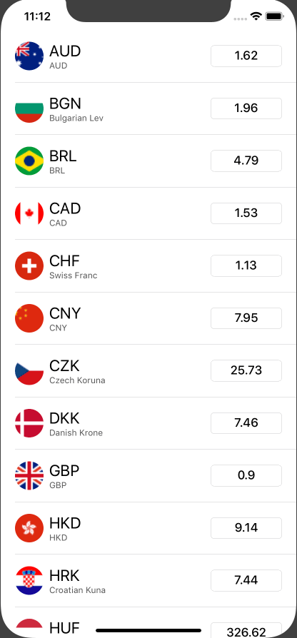

# DemoCurrencyConverter
Simple demo application of real-time currency converter app with zero dependency. Check out the [Documentaion](https://dkabyshev.github.io/DemoCurrencyConverter/).

Main design principles:
 - **MVVM**: ViewModel carries logic of triggering the fitch and pushing update to the VIewController;
 - **Dependency Injection**: Logic is separated into modules and dependecy is added via *Protocol*;
 - **Async code via simple Promise**: Tiny Promise is used to serve a purpose of clean code and delayed delegation;
 - **Tests**: Tests covers all functionality and code separation allows to avoid direct UI Tests, leaving ViewController dumb at logic.
